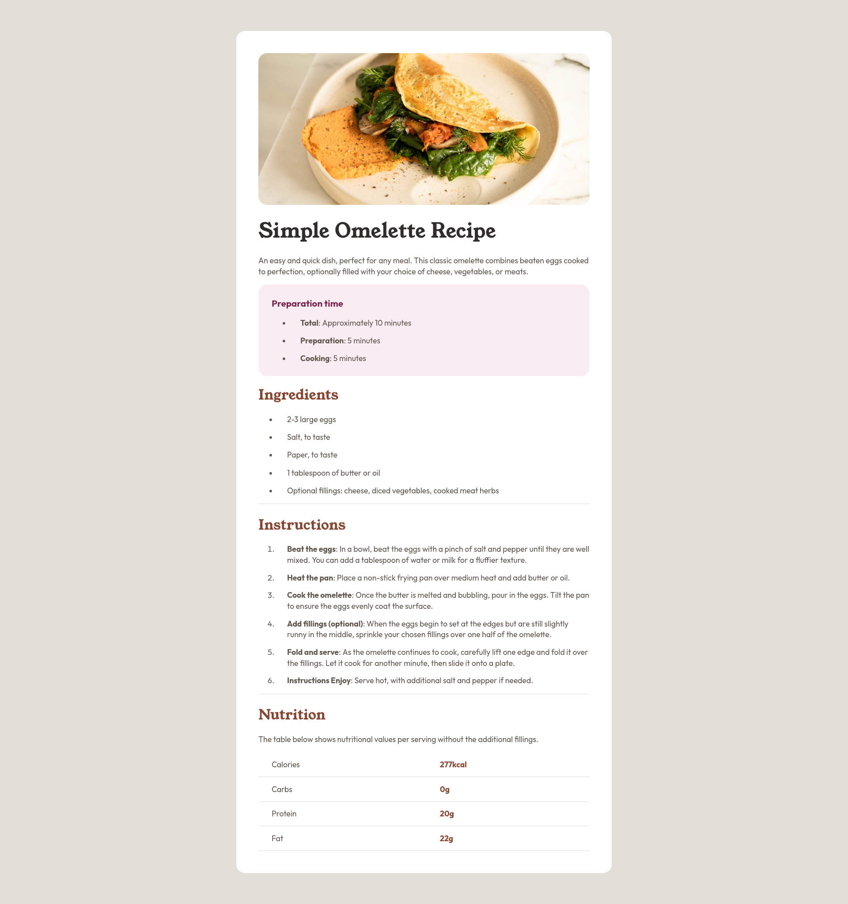

# Frontend Mentor - Recipe page solution

This is a solution to the [Recipe page challenge on Frontend Mentor](https://www.frontendmentor.io/challenges/recipe-page-KiTsR8QQKm). Frontend Mentor challenges help you improve your coding skills by building realistic projects. 

## Table of contents

- [Overview](#overview)
  - [Screenshot](#screenshot)
- [My process](#my-process)
  - [Built with](#built-with)
  - [What I learned](#what-i-learned)

## Overview

### Screenshot

## My process

### Built with

- Semantic HTML5 markup
- CSS custom properties

### What I learned

This CSS code snippet demonstrates how to define variables and use them throughout the stylesheet. Let's break down some key takeaways:

- Custom properties: The code uses CSS variables (--clr-white, etc.) to store color values. This allows for easier maintainability and centralized control over the color scheme.
- Font Families: The code imports two fonts (Outfit and Young Serif) using the @font-face rule.
- Modular CSS: The code utilizes classes like .wrapper and .preparation--row to style specific sections of the layout.
- Responsive design principles: By setting max-width for the .wrapper class, the code ensures the content adapts to different screen sizes.
